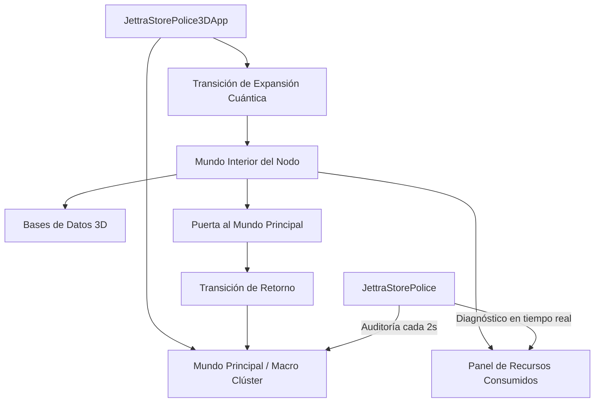

# Arquitectura del Sistema: JettraStorePolice3D

## 1. Visión General
`JettraStorePolice3D` es el entorno de monitoreo y visualización nativo 3D para el ecosistema JettraStore. Combina en una única arquitectura:
* La inteligencia y modelos de agentes autónomos (`io.jettra.core.dl`).
* El motor gráfico nativo 3D acelerado por GPU vía Jaylib-FFM (`io.jettra.core.three.d`).
* La supervisión y auditoría en tiempo real con `JettraStorePolice` y `JettraDriver`.
* El sistema de **submundos cuánticos** que permite expandir cualquier servidor de la red para visualizar sus bases de datos internas, buckets y consumo de recursos.

## 2. Subsistemas Principales

### A. Capa de Modelos y Nodos (`ServerNode3D` y `DatabaseInfo3D`)
* Cada servidor mantiene su posición espacial, dimensiones y `BoundingBox` para detección de interacción por rayos de ratón (*raycasting*).
* Aloja una colección de `DatabaseInfo3D`, las cuales detallan el motor de almacenamiento, cantidad de objetos (ej. 3.75M en facturas, 2M en hospital, 3M en ambiental), volumen en disco/RAM y sus buckets especializados.

### B. Máquina de Estados de Mundo (`WorldMode`)
* `MAIN_WORLD`: Representación 3D del clúster con la ciudad, agentes civiles y la entidad `JettraStorePolice` patrullando.
* `EXPANDING_TRANSITION`: Efecto visual de desintegración cuántica y expansión del servidor al hacer clic sobre él.
* `INNER_NODE_WORLD`: Dimensión digital estilizada (cyber-grid Tron) donde orbitan las bases de datos del nodo.
* `EXITING_TRANSITION`: Efecto de vórtice dimensional activado por la Puerta de Retorno.

### C. La Puerta al Mundo Principal (Portal 3D)
* Diseñada como una arcada monumental con vórtice de anillos concéntricos en plasma giratorio.
* Posee colisión por raycasting y disparador de proximidad física que devuelve al operador al clúster macro de forma instantánea.

## 3. Modelo de Telemetría en Tiempo Real y Gestión de Conexiones

### A. Gestión de Conexiones (`ConnectionManager` & `ConnectionProfile`)
* **Persistencia JSON**: Los perfiles de conexión se almacenan en `memory/connections.json` con soporte para URLs multimodelo (`tcp://`, `jettra://`, `http://`), credenciales y marca `isDefault`.
* **Conmutación Dinámica**: Permite el cambio de servidor en caliente (`switchConnection`) reconectando el `JettraClient` y actualizando en tiempo real la topología de la ciudad 3D.

### B. Mapeo Determinista de Entidades en Tiempo Real
* **Personas (`JettraLiveSession`)**: No son peatones con movimiento aleatorio; son usuarios reales que se mueven entre el edificio de su sede (`UserZoneGroup`) y los nodos servidores según el ciclo de vida de sus consultas (`APPROACHING_NODE` -> `EXECUTING_QUERY` -> `RETURNING_TO_BUILDING` -> `IDLE_IN_BUILDING`).
* **Edificios (`UserZoneGroup`)**: Agrupación física de usuarios por proximidad de subredes IP en sedes comunes con cálculo de tráfico en MB/s.
* **Perros (`JettraPoliceAgent`)**: Caninos guardianes (`HEAP_SENTINEL`, `RAFT_QUORUM_K9`, `MEMTABLE_PURGE_DOG`, `SECURITY_PATROL`) que patrullan circularmente los nodos asignados y reaccionan de inmediato ante alertas y cambios en la salud de JettraStore.
* **Camiones (`ClusterDataTraffic`)**: Paquetes de datos reales en tránsito entre nodos primarios y secundarios, transportando lotes de facturas, historiales clínicos, vectores AI o logs de consenso Raft.

## 4. Gestión de Usuarios y Roles Multimodelo (`UserManager` & `JettraUser`)

`JettraStorePolice3D` incluye un panel completo de administración de seguridad y acceso multibase de datos (`KEY_U` o botón `[👥 USUARIOS]` en la barra lateral):
* **Persistencia Atómica**: Almacenado en `memory/security/users.json` con soporte JSON serializado vía Jackson.
* **Operaciones CRUD**: Creación de nuevos usuarios, edición de credenciales y descripciones, y eliminación segura con protección irrevocable del usuario raíz `admin`.
* **Roles Globales de Sistema**:
  * `ADMIN`: Control total de clúster, configuración y seguridad.
  * `OPERATOR`: Administración operativa de nodos y monitoreo de salud.
  * `DEVELOPER`: Ingesta, ejecución de consultas multimodelo y gestión de esquemas.
  * `ANALYST`: Ejecución de consultas analíticas OLAP, vectoriales y grafos.
  * `AUDITOR`: Inspección de bitácoras, cumplimiento y logs de `JettraStorePolice`.
  * `GUEST`: Acceso no autenticado o de demostración con permisos restringidos.
* **Matriz de Permisos por Base de Datos**: Asignación granular e interactiva de permisos (`NONE`, `READ_ONLY`, `READ_WRITE`, `ADMIN`) para cada base de datos registrada en el servidor (`example_factura_db`, `samples_hostipal_db`, `samples_ambiental_db`, `system_metadata_db`).

## 5. Explorador Multimodelo de Motores y Registros Paginados (`EngineDataCatalog`)

Accesible directamente mediante **clic derecho sobre cualquier base de datos 3D** en el Mundo Interior del Nodo, mediante el atajo `KEY_E` o con el botón `[🌳 ENGINES / DATOS]`:
* **Estructura en Árbol Jerárquico**:
  * `DOCUMENT`: Documentos JSON/BSON con esquemas flexibles y timbrado (`facturas`, `detalles_factura`, `clientes`, `pacientes`, `medicamentos`).
  * `GRAPH`: Redes de grafos, vértices y relaciones ponderadas (`red_comercial`, `red_hospitalaria`, `red_ecosistemas`).
  * `VECTOR`: Embeddings vectoriales de alta dimensión para IA y búsqueda semántica Top-K (`factura_embeddings`, `expediente_embeddings`, `clima_embeddings`).
  * `JAVA_RECORD`: Tipos fuertemente tipados in-memory Java 25 (`ProductRecord`, `FacturaRecord`, `PatientRecord`, `SensorRecord`).
  * `KEYVALUE`: Almacén de pares clave-valor ultrarrápido Off-Heap con expiración (`cache_folios`, `sesiones_activas`, `alertas_cache`).
  * `TIMESERIES`: Métricas temporales cronológicas continuas (`volumen_facturacion`, `signos_vitales`, `temperatura_global`).
  * `GEOSPATIAL`: Coordenadas georreferenciadas con indexación espacial (`sucursales_fiscales`, `geolocalizacion_hospitales`, `sensores_satelitales`).
  * `COLUMNAR`: Almacén columnar OLAP vectorizado para agregaciones masivas (`metricas_fiscales_olap`, `estadisticas_clinicas`, `analisis_clima_olap`).
* **Visualización y Paginación**: Navegación fluida por lotes (`◄ ANTERIOR` / `SIGUIENTE ►`), contador de registros totales, marcas temporales, tamaño en bytes y un visor/inspector JSON con sintaxis destacada en tiempo real.

## 6. Correspondencia Estricta de Objetos y Rendimiento en Tiempo Real

Los objetos visualizados en el mundo 3D ya no son aleatorios; representan fielmente el procesamiento del servidor JettraStore en tiempo real:
* **Personas**: Cada persona que camina entre las sedes y los servidores corresponde a una sesión de usuario activa en JettraStore. La cantidad de personas y sus consultas activas reflejan directamente las transacciones simultáneas del servidor.
* **Edificios**: Representan los centros de conexión y sedes geográficas conectadas a las bases de datos (Financiera, Hospital, Ambiental, Data Center), con métricas visibles de throughput e IOPS.
* **Camiones**: Cada camión que circula por las autopistas cuánticas del clúster transporta lotes de datos reales (`ClusterDataTraffic`), cuyo tamaño y cadencia se calculan en base a las operaciones por segundo (OPS/S) y a la replicación SSTable/Raft del servidor.
* **Perros**: Los agentes de `JettraStorePolice` (`HEAP_SENTINEL`, `RAFT_QUORUM_K9`, `MEMTABLE_PURGE_DOG`, `SECURITY_PATROL`) incrementan su velocidad de patrullaje, cambian de objetivo y activan alertas visuales rojas proporcionales a la saturación de objetos procesados y presión de memoria en los nodos.
