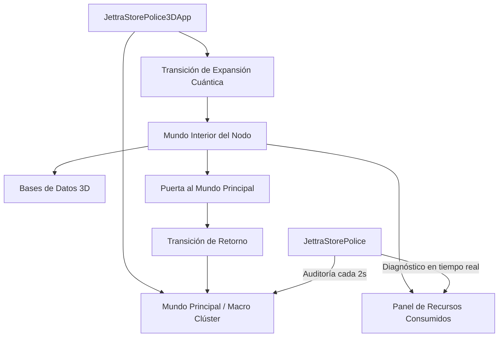

# Arquitectura del Sistema: JettraStorePolice3D

## 1. Visión General
`JettraStorePolice3D` es el entorno de monitoreo y visualización nativo 3D para el ecosistema JettraStore. Combina en una única arquitectura:
* La inteligencia y modelos de agentes autónomos (`io.jettra.core.dl`).
* El motor gráfico nativo 3D acelerado por GPU vía Jaylib-FFM (`io.jettra.core.three.d`).
* La supervisión y auditoría en tiempo real con `JettraStorePolice` y `JettraDriver`.
* El sistema de **submundos cuánticos** que permite expandir cualquier servidor de la red para visualizar sus bases de datos internas, buckets y consumo de recursos.

## 2. Subsistemas Principales

### A. Capa de Modelos y Nodos (`ServerNode3D` y `DatabaseInfo3D`)
* Cada servidor mantiene su posición espacial, dimensiones y `BoundingBox` para detección de interacción por rayos de ratón (*raycasting*).
* Aloja una colección de `DatabaseInfo3D`, las cuales detallan el motor de almacenamiento, cantidad de objetos (ej. 3.75M en facturas, 2M en hospital, 3M en ambiental), volumen en disco/RAM y sus buckets especializados.

### B. Máquina de Estados de Mundo (`WorldMode`)
* `MAIN_WORLD`: Representación 3D del clúster con la ciudad, agentes civiles y la entidad `JettraStorePolice` patrullando.
* `EXPANDING_TRANSITION`: Efecto visual de desintegración cuántica y expansión del servidor al hacer clic sobre él.
* `INNER_NODE_WORLD`: Dimensión digital estilizada (cyber-grid Tron) donde orbitan las bases de datos del nodo.
* `EXITING_TRANSITION`: Efecto de vórtice dimensional activado por la Puerta de Retorno.

### C. La Puerta al Mundo Principal (Portal 3D)
* Diseñada como una arcada monumental con vórtice de anillos concéntricos en plasma giratorio.
* Posee colisión por raycasting y disparador de proximidad física que devuelve al operador al clúster macro de forma instantánea.

## 3. Modelo de Telemetría en Tiempo Real y Gestión de Conexiones

### A. Gestión de Conexiones (`ConnectionManager` & `ConnectionProfile`)
* **Persistencia JSON**: Los perfiles de conexión se almacenan en `memory/connections.json` con soporte para URLs multimodelo (`tcp://`, `jettra://`, `http://`), credenciales y marca `isDefault`.
* **Conmutación Dinámica**: Permite el cambio de servidor en caliente (`switchConnection`) reconectando el `JettraClient` y actualizando en tiempo real la topología de la ciudad 3D.

### B. Mapeo Determinista de Entidades en Tiempo Real
* **Personas (`JettraLiveSession`)**: No son peatones con movimiento aleatorio; son usuarios reales que se mueven entre el edificio de su sede (`UserZoneGroup`) y los nodos servidores según el ciclo de vida de sus consultas (`APPROACHING_NODE` -> `EXECUTING_QUERY` -> `RETURNING_TO_BUILDING` -> `IDLE_IN_BUILDING`).
* **Edificios (`UserZoneGroup`)**: Agrupación física de usuarios por proximidad de subredes IP en sedes comunes con cálculo de tráfico en MB/s.
* **Perros (`JettraPoliceAgent`)**: Caninos guardianes (`HEAP_SENTINEL`, `RAFT_QUORUM_K9`, `MEMTABLE_PURGE_DOG`, `SECURITY_PATROL`) que patrullan circularmente los nodos asignados y reaccionan de inmediato ante alertas y cambios en la salud de JettraStore.
* **Camiones (`ClusterDataTraffic`)**: Paquetes de datos reales en tránsito entre nodos primarios y secundarios, transportando lotes de facturas, historiales clínicos, vectores AI o logs de consenso Raft.
